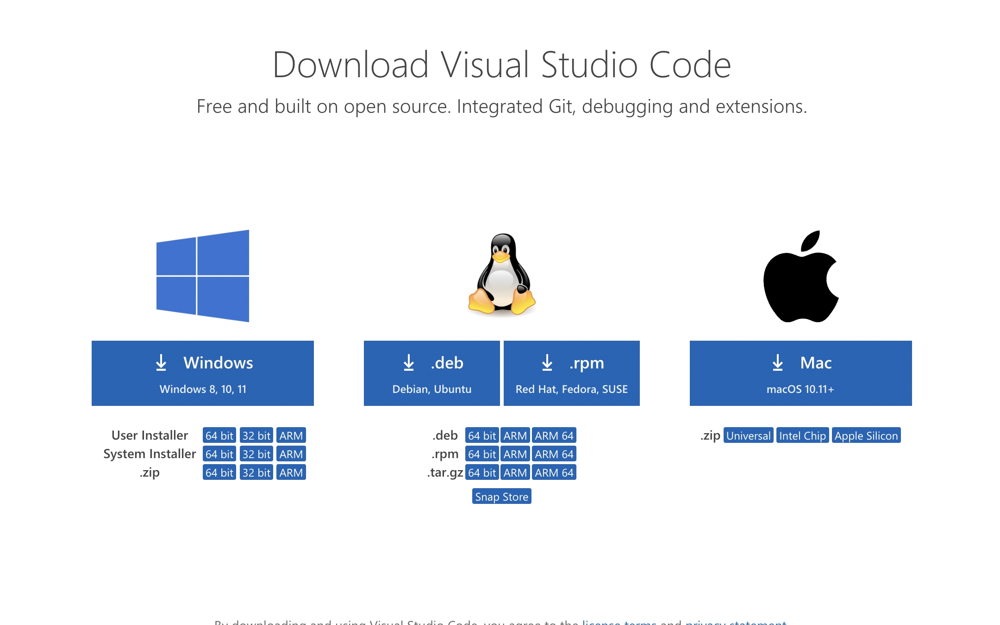
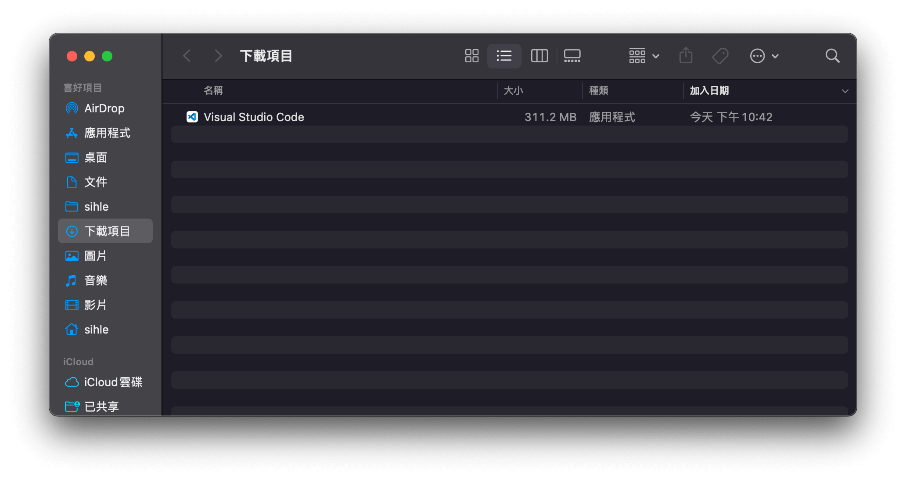
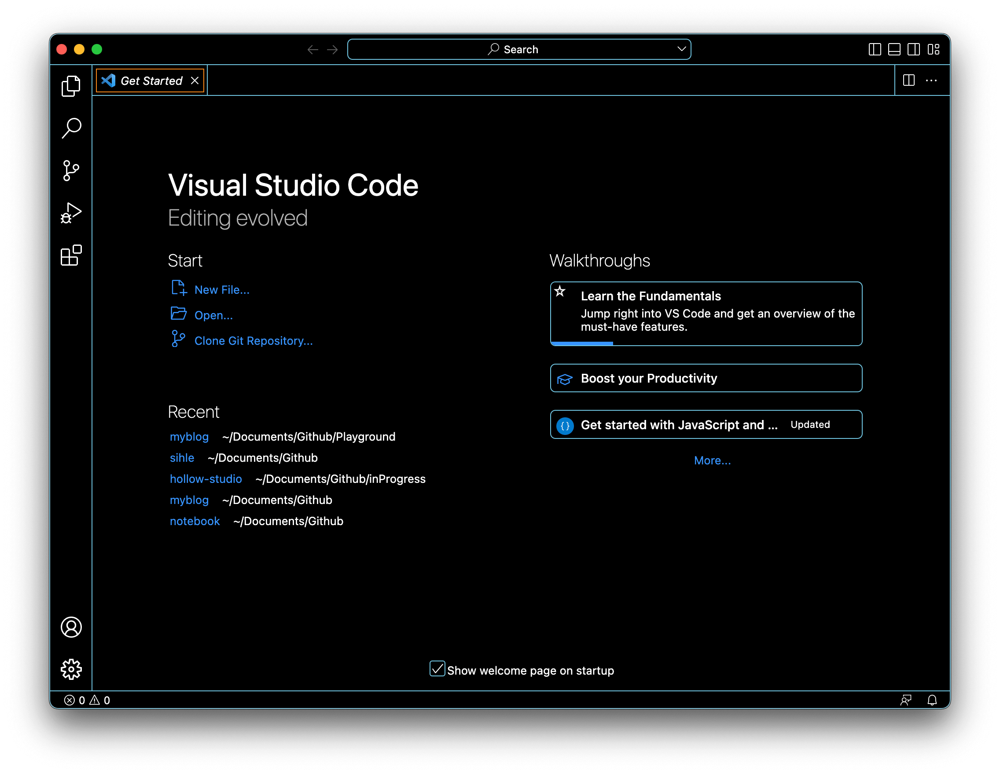
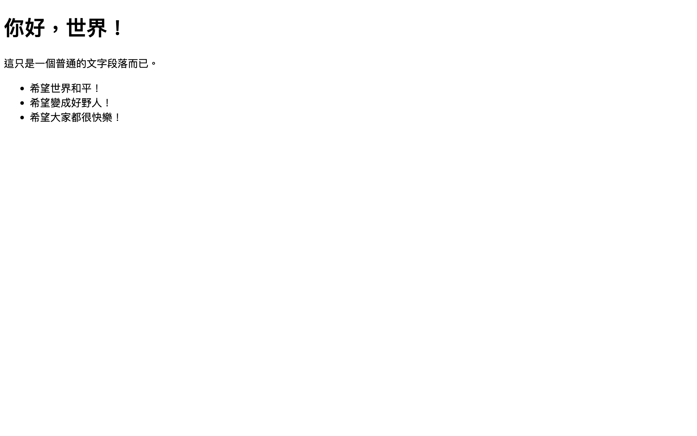

## 什麼是 HTML？

HTML 全名為 Hyper Text Markup Language，是一種標記語言，不能算是一種程式語言，因其並不包含程式邏輯運算的部分，最初的 HTML 是為了學術文件傳遞的便利性被開發出來的，目的在於提供簡單的文件架構以及內容的呈現，好讓文件可以透過網路快速的傳遞提供他人參閱。

雖然 HTML 本身的語法相當簡單、易學，但 HTML 也是相當重要的一環，單純就內容來說，善用 HTML 可以使搜尋引擎的索引排名得到優化，也就是常聽見的 SEO，妥善的規劃標籤的結構，也可以讓整體的程式碼更容易閱讀，因此，雖然 HTML 很簡單，但是卻並不總是那麼容易寫得好。

當前最熱門的版本為 HTML 5，除了汰除許多無用的標籤語法，也新增的許多「 語義化 」的語法，並新增了一些有用的 API 讓我們可以與瀏覽器進行互動，許多在過去使用 HTML 屬性進行畫面處理的問題，在此版本中，都會建議改採用 CSS 進行相關畫面的處理，讓彼此之間的架構更清晰、明朗。

## 取得好用的工具，VS Code

VS Code 全稱為 Visual Studio Code，是接下來我們將會使用的開發工具，可以將其想像為擁有許多外掛的文字編輯器，我們的 HTML 可以透過作業系統預設的文字編輯器來開發，這點是無庸置疑且可行的，但使用純文字編輯器開發會大幅的降低我們的效率，我們總是希望工作可以更快速、更好的完成，因此我們需要取得一個稱手的工具，VS Code 正是當前熱門、開源的免費開發工具之一。

由於，Windows 的安裝流程相對來說容易，只要找到下載連結、安裝，並且點按下一步即可，所以下面會介紹 Mac M1 的 VS Code 安裝方式。

首先，找到 VS Code 所有版本的下載頁面，並下載 Apple Silicon 版本的 VS Code。


接著參考下圖，將 VS Code 拖曳到「 應用程式 」這個目錄中，這是 Mac 相對於 Windows 的附屬應用程式集的概念。


以下是成功開啟 VS Code 的畫面，由於筆者的主題顏色有進行調教，可能與你的畫面會有些許差異。


> 如果需要繁體中文的朋友，可以透過左方的方塊圖案（很像積木的四個方塊）安裝套件，點選並搜尋「 chinese 」，並安裝繁體中文即可取得中文化的 VS Code，靈活的套件隨取即用，也正是 VS Code 強大之處。

## 建立第一個網頁。你好，世界。

這個小節會先帶你做出一個網頁，並針對這個網頁的結構、內容，進行詳細的說明。

接著，請你參考下方的程式碼，撰寫屬於你自己的第一個網頁，並在完成程式碼撰寫後，將檔案名稱儲存為 `index.html`。

```html
<!DOCTYPE html>
<html lang="zh-Hant-TW">
<head>
  <meta charset="UTF-8">
  <title>第一個網頁</title>
</head>
<body>
  <h1>你好，世界！</h1>
  <p>這只是一個普通的文字段落而已。</p>
  <ul>
    <li>希望世界和平！</li>
    <li>希望變成好野人！</li>
    <li>希望大家都很快樂！</li>
  </ul>
</body>
</html>
```

> 如果你是新手，建議可以嘗試逐個敲打出這些程式碼，而非使用複製、貼上的方式，這是為了讓你熟悉相關的語法。

接著，參考上述的程式碼，我們將進行逐行的解說。

程式碼的第一行，用於宣告文檔本身的類型。在 HTML 中，雖然我們可以透過檔案的後綴檔名（即副檔名），來讓系統自動對應相關的檔案開啟方式，因此使用 `.html` 會自動地以瀏覽器開啟 HTML 檔案，進而瀏覽網頁內容，即使不特別宣告文檔類型，檔案依然可能被開啟並瀏覽，但卻可能發生預期外的問題，例如：使用 CSS 排版時，發生排版狀況不如預期，因此最好不要貪圖方便省略這行宣告。

HTML 作為網頁的基石，主要作為內容的呈現以及網頁的結構，撰寫良好的 HTML 語法，可以讓程式碼容易閱讀，不僅僅是自己閱讀，也方便協作的開發者閱讀，在某種程度上，良好的 HTML 結構有助於 SEO，SEO 主要透過程式爬蟲爬取網頁內容，因此良好的結構也會便於爬蟲進行爬取，進而提升網站的排名。

### 名詞解釋

#### 標籤（ tags ）

由大於(&gt;)、小於(&lt;)符號加上標籤文字的部分，稱為「 標籤 」。

#### 元素（ elements ）

由開頭標籤(start tag)以及結尾標籤(end tag)，加上其包裹的內容，整個稱為一個「 元素 」。

所有的元素都是從 `<html>` 衍生的，因其特殊性也稱為「 根元素 」。

一般來說，元素都會具有開頭標籤以及結尾標籤，但總有特例，例如：``，我們稱這類元素為「 空元素 」。

#### 屬性（ attributes ）

在開頭標籤中，由等號連結「 屬性 」以及「 屬性值 」的語法。

一個元素可以有多個屬性，有些屬性為特定元素所有，例如：``，`src` 為 `` 特有的屬性，表示要顯示的圖片路徑來源。有些屬性為所有元素皆有的，稱為全域屬性（Global Attributes），例如：`id`、`class`、`lang`。

### 網頁的結構

網頁的結構相當容易理解，可以簡單的分成兩部分：

1. `<head>` 區塊，為不顯示的中介資料。
2. `<body>` 區塊，為網頁主要顯示的內容部分。

在 `<head>` 中，主要放置不會顯示在網頁上的中介資料，中介資料即透過資料處理資料，這段文字有點繞，我們參考上述程式碼的第四行來進行解說，所謂的程式碼也是資料，也就是目前程式碼第四行的 `<meta charset="UTF-8">`，透過這行語法，解決了過去打開網頁可能會顯示亂碼的問題，網頁的文字在透過瀏覽器解析時，會有所謂編碼的問題，而「 UTF-8 」即所謂的萬國碼，透過設定網頁顯示的編碼為 UTF-8，解決了不同語系編碼不同的問題，進而解決亂碼顯示的問題。

所以，透過在 `<head>` 中加入一些語法，雖然這些資料不會顯示，但是可以解決一些我們可能會遇到的問題，例如：瀏覽器相容性、網頁響應式設計。

在 `<body>` 中，主要放置會顯示在網頁上的資料，也就是會被使用者看見的內容，內容的呈現，主要透過不同的元素包裹不同的資料內容，進而達到資料結構化的目的，並且由於瀏覽器針對這些元素預設的樣式，我們可以得到一個很簡易的文字排版內容，方便我們進行網頁的瀏覽，也是網頁最原始的風貌。

而在 `<body>` 中的元素，例如：`<h1>`、`<p>`，有其分別代表的含義，分別為 heading 以及 paragragh，也就是標題以及段落的意涵，因此針對不同資料結構內容，我們會使用相對應的語法，例如：清單型態的資料會使用 `<ul>`、`<ol>`，分別是無序的清單以及有序的清單，採用此種方式進行 HTML 語法的撰寫，會讓你的程式碼更有架構，也會讓協作開發者更容易閱讀。

下圖為「 你好，世界 」網頁的完成圖。



> 筆者沒有針對各個元素的用法進行說明，這方面的教學參考連結都附在文章的最下方。

## 何謂語義化的結構？

在 HTML 5 中，新增了許多「 語義化 」(Semantics)的元素，例如：`<header>`、`<footer>`、`<main>`，其實單看英文就可以明瞭語義化其所代表的意涵，即使一個完全不懂 HTML 語法的人，也可以透過這種方式，大略的了解整份文件的結構，這就是語義化的益處，此外，使用具有語義化結構的 HTML 程式碼撰寫方式也有助於 SEO。

## 未提及的東西

- [class 屬性以及 id 屬性的用途](2022-10-30-web-devlopment-css.md#class-屬性以及-id-屬性的用途)
- 檔案路徑撰寫方式
- [如何引入 CSS 樣式表](2022-10-30-web-devlopment-css.md#如何引入-css)
- 如何引入 JS 程式碼
- HTML 表單
- BOM（ HTML APIs ）
- HTML Coding Style 撰寫風格

> 這些內容是在本篇文章未提及但重要的知識點，可能會在其他部分撰寫相關知識內容後，回頭將相應知識內容超連結至此處內容。

## 參考連結

- [W3school HTML Tutorial](https://www.w3schools.com/html/default.asp)