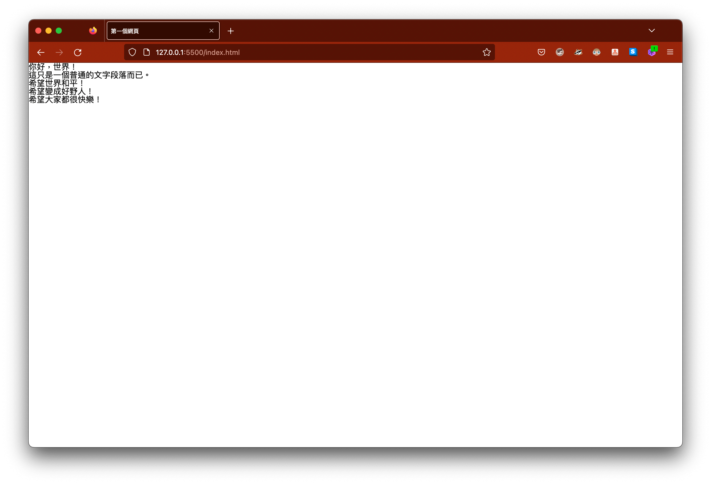
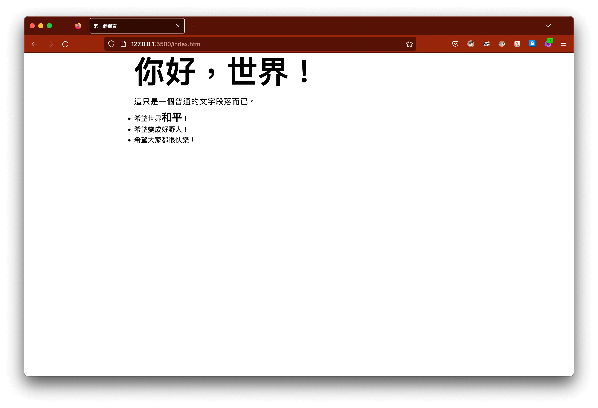

## 什麼是 CSS？

CSS 全名為 Cascading Style Sheets，層遞式樣式風格表，主要用於裝飾我們的網頁，或者對頁面上的元素位置進行配置，進一步的讓整體網頁的氛圍提升，打造更漂亮、更專業的形象外觀。

CSS 其實不僅僅應用在網頁上，如同其所帶有的特性，也可以用來替印刷刊物之類的媒體進行排版，針對不同的媒體進行客製化的設定、版面的配置，CSS 誕生正好解決了最初 HTML 的樣式管理問題，原始的 HTML 是透過屬性去進行一些細節的調教，因此當程式碼數量龐大時，相當不易閱讀以及維護。

當前熱門的版本為 CSS 3，此版的 CSS 在筆者撰寫這篇文章的當下，也仍然在進化當中，但許多應用已經相當成熟，例如：透過 CSS 進行動畫效果的撰寫，稍微有些經驗的開發者，在情況許可的情景下，大多也都會採用此種方式進行開發，因為使用原生的 CSS 動畫效果可以得到更優異的效能，而非使用 JS 大量運算、竄改樣式的做法，來進一步達到動態的效果。

## 如何使用 CSS 裝飾網頁？

在前篇 [HTML 教學](2022-10-29-web-devlopment-html.md) 中，我們學會利用 HTML 架構出我們網頁的骨架，形塑出一個簡單的網頁，基本上就是透過瀏覽器預設提供的樣式，如果你曾經使用過多個瀏覽器瀏覽網頁，也許會發現網頁的有些地方會有些許差異，這是由於各家瀏覽器所提供的技術支援有些許異同，因此當你慢慢地成為有經驗的開發者，需要適時的留心瀏覽器相容性的問題，但，好消息是，萬惡的 IE 已死，這替我們除去了諸多的問題，如果有需要支援 IE 的，請直接無視且可以帶點鄙視。

### CSS 語法

CSS 的語法很容易理解，概念上就是透過選擇器(selectors)，去對應網頁上的 HTML 元素，對應的方式可以是元素名稱，或者透過 class 選擇被附加上相同 class 的 HTML 元素，進階一點還可以操控所謂的偽類別、偽元素。當透過選擇器對應到 HTML 元素時，可以根據該元素的特性(properties)進行樣式的撰寫。

CSS 的語法結構可以參考下方的程式碼：

```css
selectors {
  property: property-value;
}
```

通常由選擇器以及大括號這樣的一組語法，會稱為一個規則集(ruleset)，可以想像成就像在替這個元素撰寫各種規則描述其特性，而其中的 `property: property-value;` 又可以稱為是一組宣告(declaration)，也是一組規則，在撰寫規則的同時，也要注意語法符號的使用，也就是冒號 `:` 以及分號 `;`，如果遺漏了會導致瀏覽器解析語法的錯誤。

### 如何引入 CSS？

一般來說，使用 CSS 的方法有三：

1. 行內 CSS，在元素的屬性 `style` 進行樣式的撰寫。
2. 頭部 CSS，在 `<head>` 中使用 `<style>` 進行樣式的撰寫。
3. 外部 CSS，在 `<head>` 中使用 `<link>` 引入外部的 CSS 檔案（最通俗的做法，因為此做法可以將 HTML 以及 CSS 的語法分開進行管理）

> 以下的內容都會是採用第三種的做法，也就是由外部引入 CSS 的做法。

### 清除預設樣式

如同前面所述，所有的瀏覽器都會提供預設的樣式，一般來說，為了讓樣式撰寫更容易，也就是不要讓預設的樣式干擾我們撰寫的樣式，通常都會事先清除預設的樣式，而後再進行樣式的撰寫。

而清除預設樣式的做法通常會有兩種：

1. 完全清除預設樣式。
2. 保留部分預設樣式，其餘樣式清除。

完全清除預設樣式的做法，通常會採用 [meyerweb.com](https://meyerweb.com/eric/tools/css/reset/) 的 CSS reset 作法，此做法可以將預設樣式清除的相當乾淨。

保留部分預設樣式的做法，通常也稱 normalize 的 CSS reset，通常會出現在 CSS 的框架，例如：Bootstrap，當然開發者可以適時的補上，需要清除的預設樣式，此種做法通常需要對 CSS 有些開發的經驗。

兩種做法沒有絕對的優劣，通常取決於當下的開發情況，舉例來說，由於 meyerweb 的 CSS reset 通常會完全清除預設樣式，但某些情況下，我們可能會需要保留標題、段落文字之間的 margin，來讓文字段落保有基本的文字排版樣式，此時 normalize 便會是比較優異的做法。

> 這篇文章雖然是給初學者的，但是不會詳細解說 CSS 的語法，需要的朋友可以參考最下方的參考連結，連結會有比較詳細的語法以及說明的教學內容，稍作閱讀之後再回來察看這篇文章，相信你會比較清楚。

### 裝飾第一個網頁

首先，我們需要對我們的網頁樣式進行初始化，也就是清除預設的樣式，此外，通常我們可以對 CSS 的檔案進行簡易的管理，這會讓我們更容易維護、閱讀我們的程式碼，因此，我們將會建立一個 `styles` 目錄，並在其中建立一個名為 `reset.css` 的 CSS 檔案，並且複製 meyerweb 中的 CSS 程式碼到其中，進而清除我們瀏覽器的預設樣式。



> 如果標題以及文字的大小相同，以及緊貼視窗的左上角，表示你已經成功清除預設的 CSS 樣式了。

> 記得要在 `index.html` 中引入 `reset.css` 才會生效！

接著，因為筆者個人不喜歡閱讀貼齊左側的文章，或者太靠近左側，因此接下來會試著將我們的版面置中，並且加上一些文字的排版效果。

```html
<!-- index.html -->
<div class="container">
  <h1 class="heading">你好，世界！</h1>
  <p>這只是一個普通的文字段落而已。</p>
  <ul class="list">
    <li class="list-item">希望世界<span class="peace">和平</span>！</li>
    <li class="list-item">希望變成好野人！</li>
    <li class="list-item">希望大家都很快樂！</li>
  </ul>
</div>
```

```css
/* styles/index.css */

/* default */
p {
  letter-spacing: 1px;
  font-size: 18px;
  margin-bottom: 16px;
}

/* utils */
.container {
  max-width: 768px;
  margin: 0 auto;
  padding: 8px;
}
.heading {
  font-size: 72px;
  font-weight: bold;
  margin-bottom: 24px;
}
.list {
  list-style-type: disc;
}
.list-item {
  margin-bottom: 8px;
}
.peace {
  font-size: 24px;
  font-weight: bold;
}
```

參考上述的程式碼對網頁進行樣式的撰寫，來達到讓網頁版面置中的效果。

首先，我們透過 `元素選擇器` 來對 `<p>` 進行預設樣式的撰寫，我希望文字可以大一些，讓閱讀體驗提升，因此設定了 18px 的字體大小，以及讓字與字間距略寬，減少字體過度密集造成的閱讀壓力。

接著，我希望可以讓整體的版面置中，因此使用了一個樣式 `.container`，透過 `margin` 的語法讓版面自動置中，並且將寬度限定在 768px，也就是直立 iPad 的螢幕寬度，並且為了不要讓文字貼其視窗邊界，給予一點點的 `padding`。

隨後的清單樣式，為了讓其 class 的命名具有結構，因此分別使用 `.list` 以及 `.list-item`，倘若有協作的開發者，一眼就可以看出此間元素樣式的對應關係，提升程式碼的可讀性，並將被清除的預設清單樣式重新設定回來。

有時候只想對行內的某些文字進行樣式的撰寫，這時候又剛好找不到適合的元素標籤可以使用，這時候就可以選擇 `<span>` 這類型的無特別意義的標籤來使用。

以下是完成圖：



## class 屬性以及 id 屬性的用途？

如果瀏覽比較早期的網頁，你可能會發現有開發者使用 `id` 這個屬性進行樣式的撰寫，雖然作法上可行，但一般來說不建議使用此種方式進行樣式的撰寫，由於 `id` 的特性只能針對一個元素進行使用，因此使用 `id` 進行樣式的撰寫，可能造成不可預期的錯誤。

與之相反，`class` 可以被重複的應用在不同的元素上，並且可以透過不同的 `class` 彼此疊加不同的樣式，進而達成一定程度的 CSS 程式碼的管理效果，因此使用 `class` 會更符合我們樣式撰寫的開發模式。

`id` 更常被用於網頁內部的超連結錨點，或者讓 `JS` 進行元素節點的擷取。

> 傳說使用 `id` 進行樣式的撰寫可以讓瀏覽器的渲染效率提升！？（I don't know.）

### 未提及的東西

- 盒模型 Box Model
- CSS 設計模式
- RWD 響應式設計
- 如何管理 CSS 程式碼？

## 參考連結

- [W3school CSS Tutorial](https://www.w3schools.com/css/default.asp)