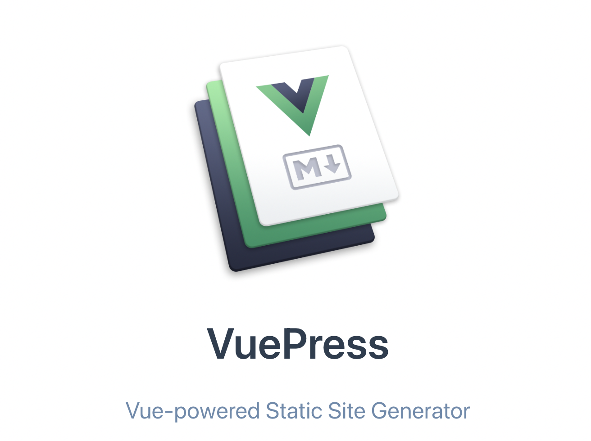
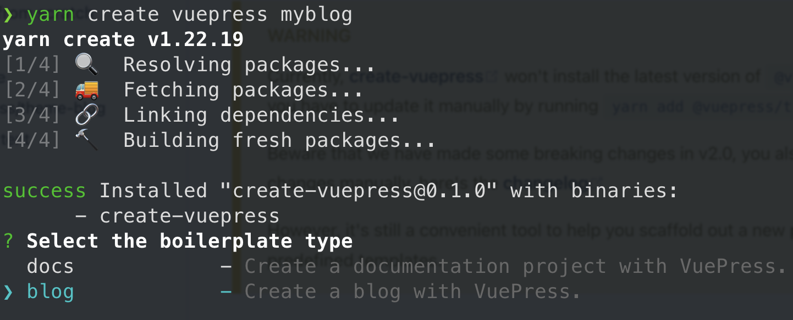
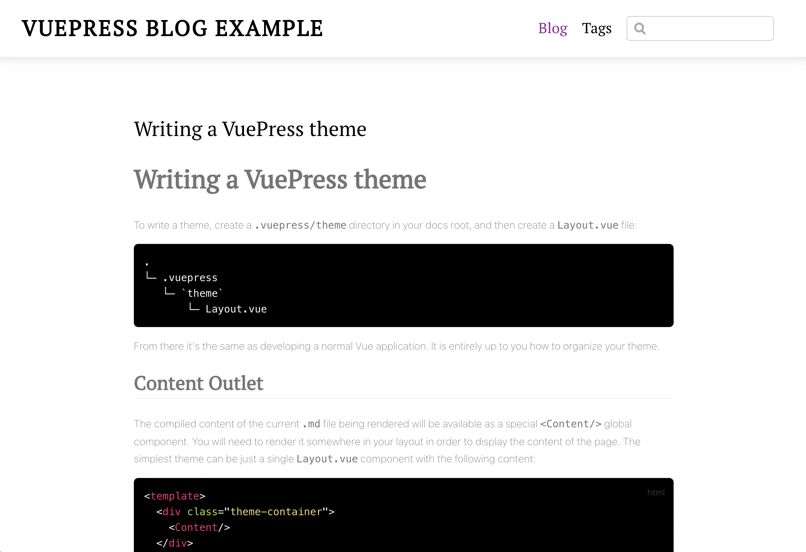
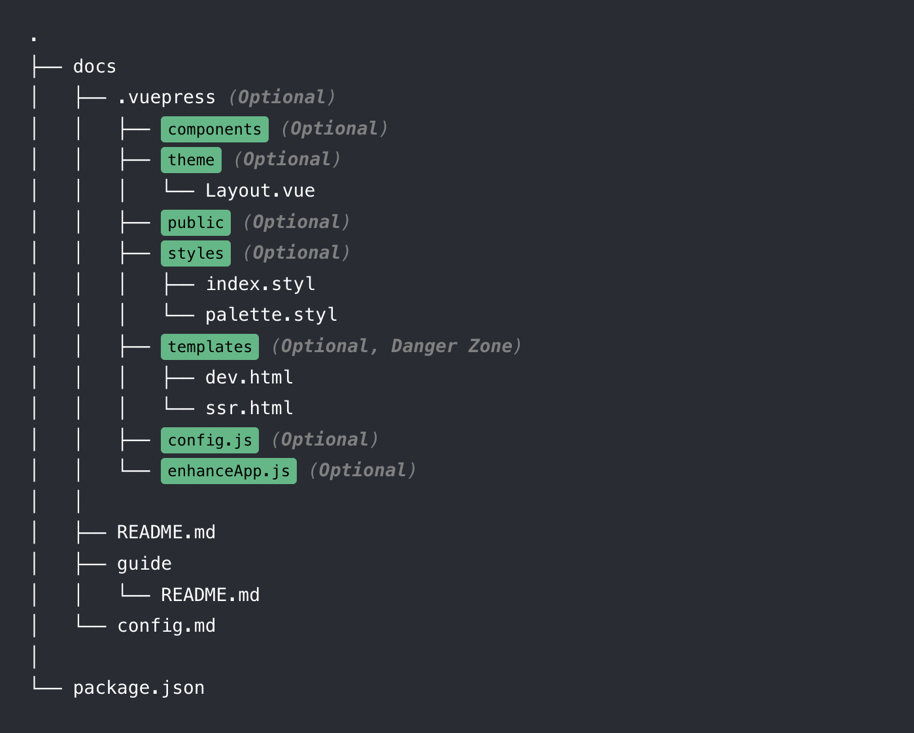
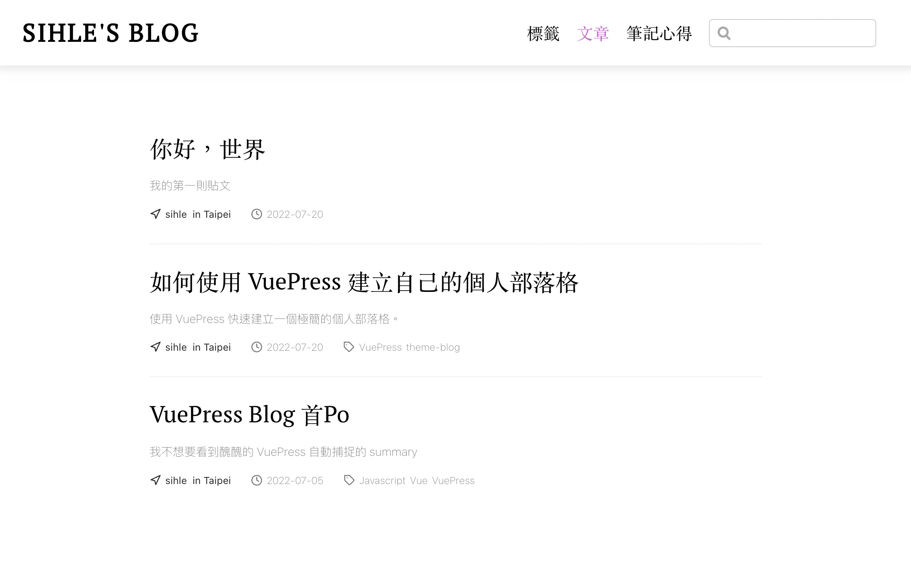
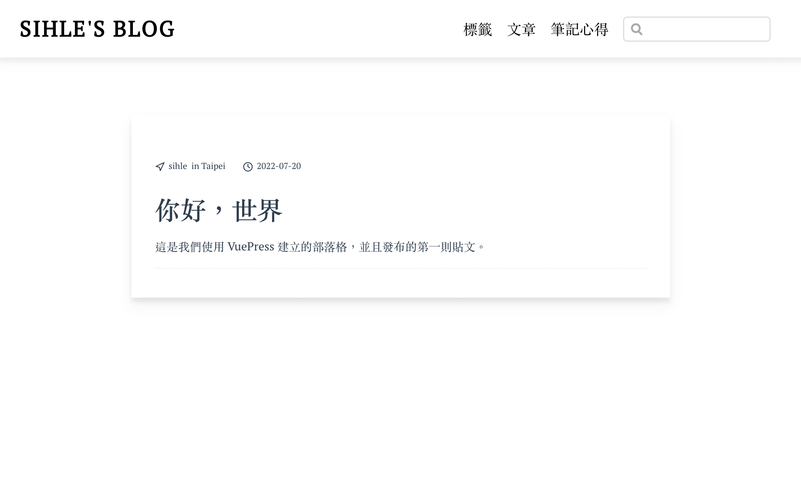

接下來我會帶你使用 VuePress 快速地建立一個極簡風格的個人部落格，但是在正式進入今天的主題之前，建議在閱讀下面的內容前，你已經熟悉或大略了解這些東西：

- [Markdown](https://markdown.tw/)
- [Vue](https://vuejs.org/)
- [VuePress](https://vuepress.vuejs.org/)

## 如何開始？

由於我們的部落格是基於 VuePress 的套件，因此首先我們必須安裝 `@vuepress/theme-blog` 這個套件。

並且，我們可以透過簡單的一個指令完成專案的初始化。

```shell
# 建立專案並進入互動模式
yarn create vuepress [blogName]

# 切換目錄並安裝所需檔案
cd [blogName] && yarn

# 開啟開發預覽模式
yarn dev
```

過程預覽：


> 以下如果遇到相關的套件安裝，都會使用 `yarn` 進行，這是基於 VuePress 官方的建議

輸入指令後，首先會提示你要使用 vuepress 建立專案，要採用一個文件模板還是部落格模板，由於我們要建立的是一個部落格，所以這裡務必要選取 blog 的選項。但是萬一選錯了，且你也無法自行安裝 `plugins` 並進行相關設定的情況下，那就只好把專案刪除重來囉~

另外，還有一點需要注意的是，透過這個方式建立的專案，預設的套件版本是相對比較舊的，建議可以執行下面的指令，將套件版本進行更新，這是為了避免有些功能無法使用。

```shell
yarn add vuepress @vuepress/theme-blog -D
```

如果一切都相當順利的話，你會在終端看到 `http://localhost:8080/` 類似這樣的網址，表示目前本地端開發用的網站伺服器已經被開啟，我們透過此連結預覽我們的部落格。



## 專案目錄結構

下面我簡單的解說專案的相關檔案目錄結構，由於是基於 `VuePress`，所以如果你已經了解的話，這部分可以徑直跳過。

由於我們的 `VuePress` 是基於 [Convention over configuration](https://en.wikipedia.org/wiki/Convention_over_configuration) 所以了解相關的結構，會有助於我們對部落格進行客製化的調校。

檔案目錄結構：


- `docs` - 對應我們專案中的 `blog`。
- `_posts` - 是必須同名且存在的目錄，其中存放相關的部落格文章。
- `.vuepress` - VuePress 的相關設定目錄。
- `.vuepress/config.js` - VuePress 的主要設定檔。

## `.vuepress/config.js`

在 VuePress 中，不論是要使用套件或者引用相關主題，都需要在 `.vuepress/config.js` 中進行設定，這一小節，我們就來簡單的看看這個檔案。

```js
module.exports = {
  title: 'VuePress Blog Example',
  description: 'This is a blog example built by VuePress',
  theme: '@vuepress/theme-blog', // OR shortcut: @vuepress/blog
  themeConfig: {
    /**
     * Ref: https://vuepress-theme-blog.ulivz.com/#modifyblogpluginoptions
     */
    modifyBlogPluginOptions(blogPluginOptions) {
      return blogPluginOptions
    },
    /**
     * Ref: https://vuepress-theme-blog.ulivz.com/#nav
     */
    nav: [
      {
        text: 'Blog',
        link: '/',
      },
      {
        text: 'Tags',
        link: '/tag/',
      },
    ],
    /**
     * Ref: https://vuepress-theme-blog.ulivz.com/#footer
     */
    footer: {
      contact: [
        {
          type: 'github',
          link: 'https://github.com/ulivz',
        },
        {
          type: 'twitter',
          link: 'https://twitter.com/_ulivz',
        },
      ],
      copyright: [
        {
          text: 'Privacy Policy',
          link: 'https://policies.google.com/privacy?hl=en-US',
        },
        {
          text: 'MIT Licensed | Copyright © 2018-present Vue.js',
          link: '',
        },
      ],
    },
  },
}
```

- `title` - 部落格的頁籤標題
- `description` - 相當於 HTML 中 `meta` 的 `description` 屬性
- `theme` - 使用的 VuePress 主題
- `themeConfig` - 主題相關設定

這裡唯一比較需要注意的是，在 VuePress 中，不同的主題可能會有不同的設定，這部分需要針對各個主題的文件去進行閱讀、設定，舉例來說，在我們的 theme-blog 這個主題中，有 `footer` 這個屬性可以去設定聯絡資訊 `contact` 以及部落格的所有權註記 `copyright`，在別的主題中也許就沒有 `contact` 這個屬性可以去進行設定。

## 發布第一則貼文

這一節我們來發布我們的第一則貼文。

在 VuePress 中，我們會透過 `Markdown` 的語法來進行文章的撰寫，最終這些 `.md` 的文件，都會被 VuePress 轉換成 `.html` 檔案，因此我們並不需要清楚的知道相關的底層原理，只要知道最後的預覽結果是我們想要的即可。

```md
<!-- 2022-7-20-first-post.md -->
---
date: 2022-07-20
tag: 
  - frontmatter
  - vuepress
author: sihle
summary: '我的第一則貼文'
location: Taipei  
---

# 你好，世界

這是我們使用 VuePress 建立的部落格，並且發布的第一則貼文。
```

首先，這裡我們需要注意到這個檔案的命名方式，前綴的日期透過 `-` 的方式串連，並在最後才標註檔名，這種方式有助於 `theme-blog` 解析我們的檔案名稱，並且進行相關的對應到網頁的網址上，當然這並不是必要的。

接著，由 3 個 `-` 串連的 `---` 前後包裹著一些語法的這坨東西稱為 `frontmatter`，而這個對應的語法稱為 `YAML` 這裡不深入說明這兩個東西，記住這樣的格式並且了解這樣的語法，這可以替我們的文章進行 SEO 優化，以及提供一些文章的相關資訊給我們的部落格網站使用，例如：`tag` 可以提供這篇文章的分類，並且可以在導覽列的地方，連結到進行分類文章的檢索頁面。

文章列表預覽：


文章內容預覽：


## 結語

以上就是今天的使用 VuePress 建立個人部落格方法，不過這篇文章沒有撰寫部署的到線上的部分，我將相關的文章連結放置在下方的參考連結中了，需要的朋友可以逕自參閱。

## 參考連結

- [@vuepress/theme-blog](https://vuepress-theme-blog.billyyyyy3320.com/)
- [VuePress - Deploying](https://vuepress.vuejs.org/guide/deploy.html)