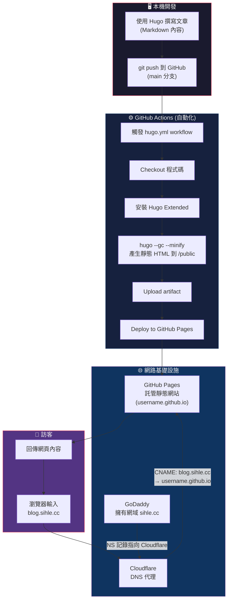

# 部落格運作流程

## 整體架構圖



## 各階段詳細說明

### 1️⃣ 本機開發 — Hugo 靜態網站產生器

在本機用 **Hugo** 撰寫部落格，專案結構如下：

| 目錄 / 檔案 | 用途 |
|---|---|
| `content/` | Markdown 文章內容 |
| `layouts/` | HTML 版面模板 |
| `assets/` | CSS / JS 等前端資源 |
| `static/` | 不需處理的靜態檔案（圖片等） |
| `hugo.toml` | 網站設定（`baseURL = 'https://blog.sihle.cc/'`） |

Hugo 是**靜態網站產生器**，它把 Markdown + 模板**編譯**成純 HTML/CSS/JS，不需要後端伺服器。

---

### 2️⃣ GitHub Actions — 自動建置與部署

當 `git push` 到 `main` 分支時，`.github/workflows/hugo.yml` 會自動觸發，分兩個 Job 執行：

```
Job 1: build                    Job 2: deploy
┌─────────────────┐            ┌─────────────────────┐
│ Checkout 程式碼  │            │ Deploy to            │
│       ↓         │            │ GitHub Pages         │
│ 安裝 Hugo       │  ───────►  │ (需要 build 完成後)   │
│       ↓         │            └─────────────────────┘
│ hugo --gc --minify│
│       ↓         │
│ Upload /public  │
└─────────────────┘
```

- **Build Job**：把 Hugo 原始碼編譯成靜態網站（`/public` 目錄），打包為 artifact
- **Deploy Job**：取得 artifact，部署到 GitHub Pages 服務

---

### 3️⃣ GitHub Pages — 靜態網站託管

GitHub Pages 接收部署的靜態檔案後，透過 `username.github.io` 提供服務。在 GitHub Pages 設定中指定了**自訂網域** `blog.sihle.cc`，GitHub 會：

- 產生一個 `CNAME` 檔案
- 自動簽發 SSL 憑證（HTTPS）

---

### 4️⃣ GoDaddy → Cloudflare → GitHub Pages（DNS 流程）

這是訪客從瀏覽器到網站的路徑：

```
訪客輸入 blog.sihle.cc
        │
        ▼
   DNS 查詢：blog.sihle.cc 的 IP 是什麼？
        │
        ▼
┌─────────────────────────────────────────────┐
│  GoDaddy（網域註冊商）                        │
│  ► NS 記錄指向 Cloudflare 的 Name Server      │
│  ► 意思是：「DNS 解析別問我，去問 Cloudflare」  │
└─────────────────────────────────────────────┘
        │
        ▼
┌─────────────────────────────────────────────┐
│  Cloudflare（DNS 代理 + CDN）                 │
│  ► CNAME 記錄：blog.sihle.cc → xxx.github.io │
│  ► 開啟代理（橘色雲朵 ☁️）後：                  │
│    - 流量先經過 Cloudflare                     │
│    - 提供 CDN 快取、DDoS 防護、SSL 等          │
└─────────────────────────────────────────────┘
        │
        ▼
┌─────────────────────────────────────────────┐
│  GitHub Pages                                │
│  ► 回傳 Hugo 產生的靜態 HTML/CSS/JS           │
└─────────────────────────────────────────────┘
        │
        ▼
   訪客看到 blog.sihle.cc 的內容 ✅
```

---

### 5️⃣ 各服務的角色分工

| 服務 | 角色 | 需要做什麼 |
|---|---|---|
| **GoDaddy** | 網域註冊商（買網域的地方） | 將 NS 記錄改為 Cloudflare 提供的 Name Server |
| **Cloudflare** | DNS 管理 + CDN + 安全防護 | 設定 CNAME 記錄指向 GitHub Pages |
| **GitHub** | 程式碼倉庫 + CI/CD + 靜態託管 | Push 程式碼，其餘 Actions 自動處理 |
| **Hugo** | 靜態網站產生器 | 本機撰寫 Markdown，框架幫你編譯成 HTML |

---

### 🔑 一句話總結

> **用 Hugo 寫文章 → Push 到 GitHub → Actions 自動編譯並部署到 GitHub Pages → Cloudflare 代理 DNS 讓 `blog.sihle.cc` 指向 GitHub Pages → 訪客透過 Cloudflare 的 CDN 存取網站。**
